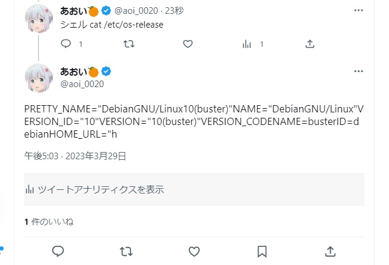

# raspi-twitter-bashbot

TwitterAPI有料化に伴い公式APIを使用して動作するようにし、セットアップをさらに簡単にしました。(半分アウトかもしれないけどw) 

TwitterでPOSIXコマンドの実行結果を返す簡単なPythonスクリプトです
chroot環境でコマンドが実行されるためメインOSに被害なく実行することができます



# 依存関係

スクリプト実行時に自動でインストールが実施されるため事前準備は必要ありません  
ラズパイ以外でも使えますが必ずDebian派生のOSで実行してください  

# 実行する前に

Bot用のアカウントで実行してください。(実行するにあたって事前に開発者アカウントを取得する必要はありません)
また2GB以上の空き容量が必要です

# 実行の仕方

main.shを実行するとセットアップがスタートします。  
初回実行時のみ、URLにアクセスするように促されることがあります。その際はアカウントを認証してPINコードを入力してください。  
1度セットアップをすれば次回以降同じコマンドでBotを起動できます  
chrootで実行するためrootアカウントでの実行をお勧めします  


セットアップや起動する場合はこのコマンドを使用します。 
```sh
bash <(curl -s https://raw.githubusercontent.com/Aoi-Developer/raspi-twitter-bashbot/main/main.sh)
```

もしも不正な操作によりBotが破壊されてしまった場合は以下のコマンドで環境を消去できます  

```sh
bash <(curl -s https://raw.githubusercontent.com/Aoi-Developer/raspi-twitter-bashbot/main/main.sh) -r
```
ヘルプを参照したい場合は-hオプションが使用できます
```sh
bash <(curl -s https://raw.githubusercontent.com/Aoi-Developer/raspi-twitter-bashbot/main/main.sh) -h
```
